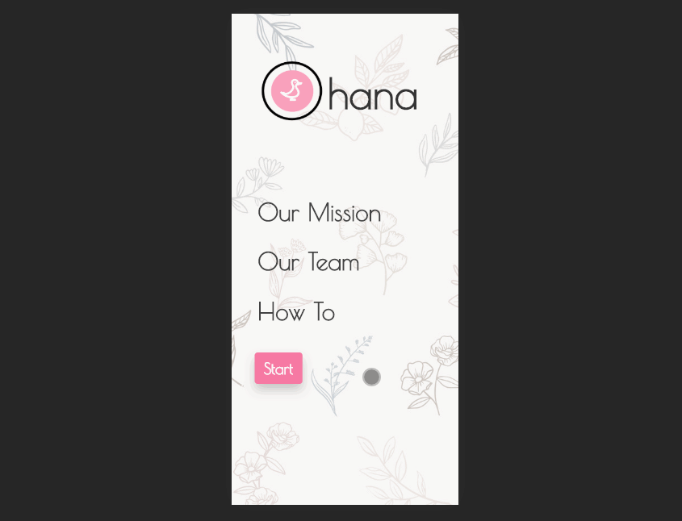

# Ohana Tracker New Parent Application
## Live Demo: [Link](http://www.ohanatracker.com)

Welcome to Ohana Tracker! This application was developed to make the lives of new parents easier. 
Here you can easily track your child's bowel movements, feedings, and naps. 
Our carefully designed User Interface highlights one handed operation and minimizes manual input. 
This application is currently in development and was optimized for mobile use. 
Cross browser compatability and desktop view is in progress.  
*Disclaimer: please note that this app is just for demonstration and is not intended for real world use*

# Getting Started

## Initial Setup

1. Fork this repo and clone from the terminal. 

       $ git clone https://github.com/elliotjhan/ohana

2. Navigate into cloned directory and be on the master branch

       $ npm install

3. Start a dev environment with Apache2 and MySQL
    * Ensure that the port is on 3001
    * Create a database in phpMyAdmin and import the sql file
    * Create a new db_connection.php with your own credentials

4. Initiate the dev server

       $ npm run watch

5. Go to `localhost:3001` and enjoy

# Technologies 

1. React.js
2. HTML5
3. CSS3
4. Bootstrap 4
5. PHP
6. MySQL
7. phpMyAdmin 

# Contributing

I welcome all tips and suggestions on improving the site. 
Feel free to submit pull requests and ask me questions through elliotjhan@gmail.com.

# License

[MIT License](https://opensource.org/licenses/mit-license.php)
